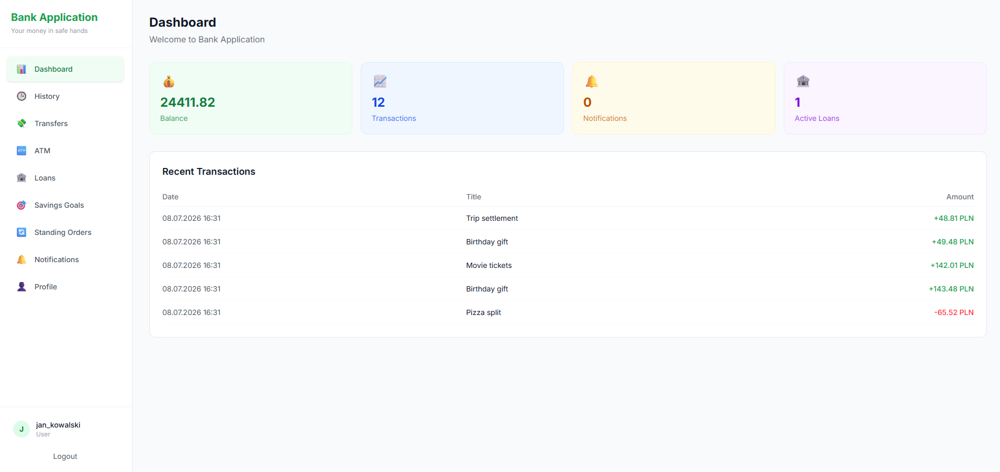
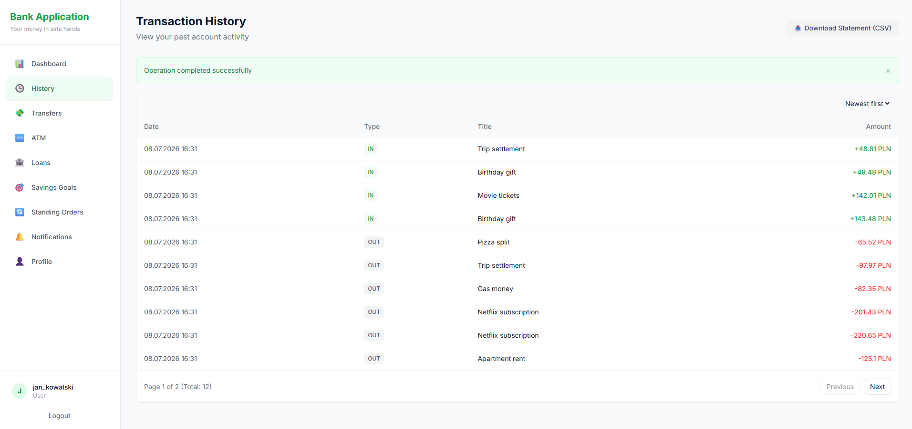
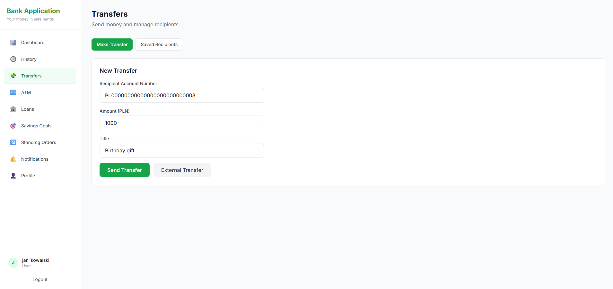
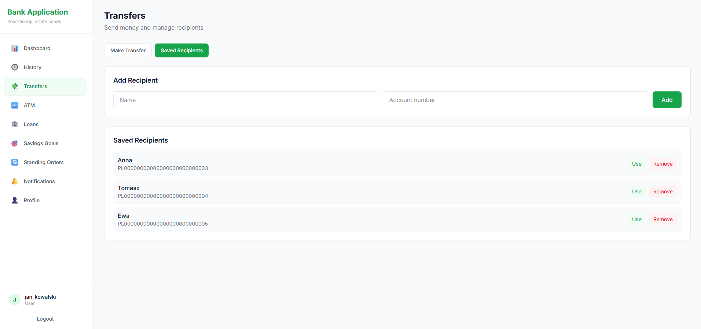
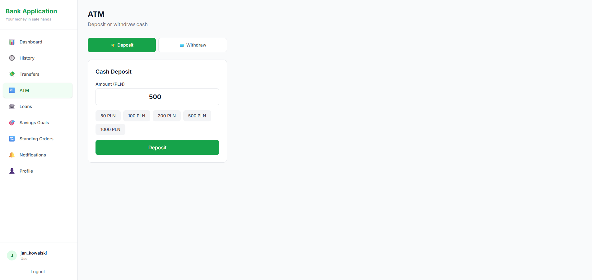
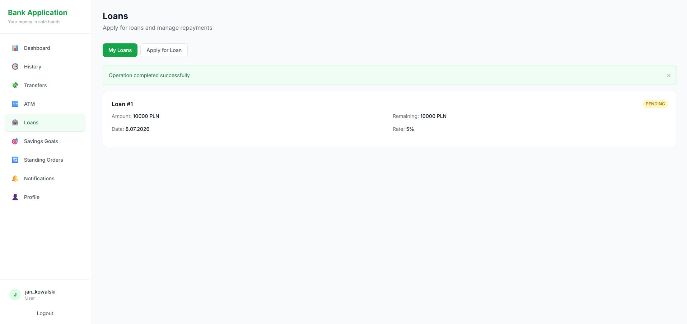
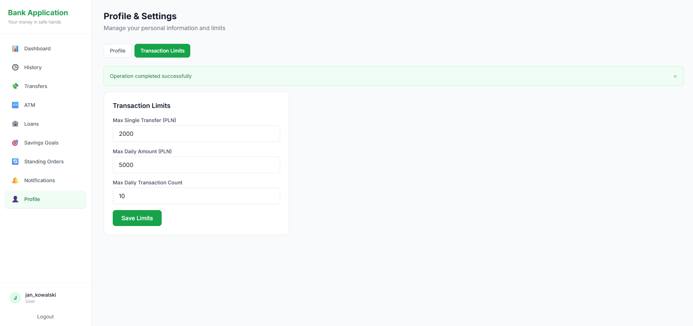

# Bank-Application

A full-stack banking application built as a university group project by a team of five, developed collaboratively using Git. The project simulates core online banking functionality — accounts, transfers, ATM operations, loans, and user profile management.

The original group project was not fully completed within the course timeline. It is currently being developed further and maintained independently by me.

## Screenshots

Example:

## Tech Stack

**Backend**
- Python (FastAPI, PyTest, Pydantic)
- SQLite

**Frontend**
- React
- Tailwind CSS

## Features

### Implemented

- **Authentication** — user registration and login
- **Dashboard** — displays account balance, number of transactions, number of notifications (notifications themselves not yet implemented), number of active loans, and the 5 most recent transactions
- **Transaction History** — displays transaction history (date, type: `IN`, `OUT`, `OUT_EXTERNAL`, title, amount), with sorting from newest to oldest
- **Statement Export** — download a CV/statement of transaction history
- **Transfers**
  - Internal transfers (within the bank)
  - External transfers (to accounts outside the bank)
  - Saved Recipients — add a recipient with name and account number, view the list of saved recipients, quickly reuse a recipient's account number via **Use**, or remove a recipient
- **ATM** — deposit and withdraw funds
- **Loans** — apply for a loan; a user with an existing unpaid active loan cannot apply for another
- **Profile** — update first name, last name, phone number, and transaction limits (max single transfer, max daily amount, max daily transaction count)

### Planned

- Saving goals
- Standing orders
- Notifications
- Completion of the admin panel

## Technical Instructions

### 1. Installation and Setup

Before running the project for the first time, the environment needs to be prepared manually:

**Backend:**
1. Navigate to the `backend/` directory.
2. Create a virtual environment: `python -m venv .venv`.
3. Activate the environment:
   - Windows: `.venv\Scripts\activate`
   - macOS/Linux: `source .venv/bin/activate`
4. Install dependencies: `pip install -r requirements.txt`.

**Frontend:**
1. Navigate to the `frontend/` directory.
2. Install packages: `npm install`.

### 2. Running the Project

Once the dependencies are installed, you can use the provided startup scripts:

- **Windows:** run `start.bat`
- **macOS/Linux:** run `bash start.sh`

These scripts check for the presence of Node.js and Python, then start both the backend and frontend servers as separate processes.

## Project History

This project began as a five-person team assignment for a university course, with collaboration managed through Git. Development continues independently, with ongoing improvements and new features being added over time.
